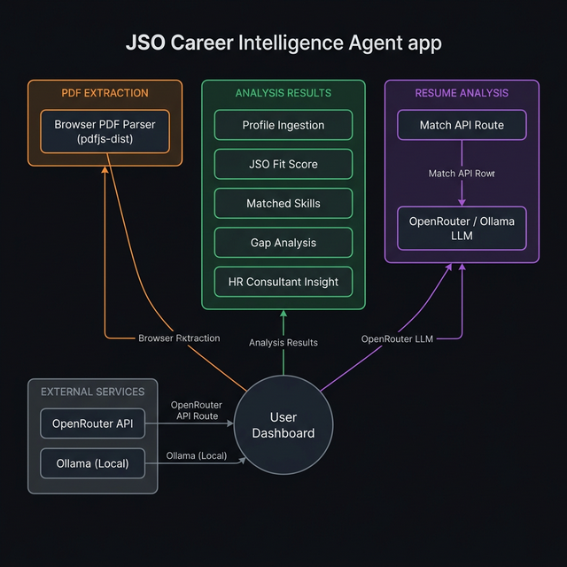
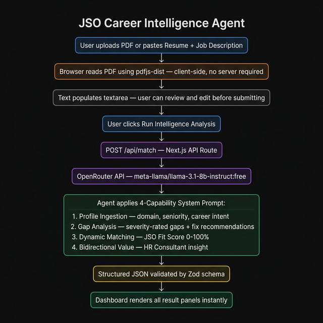

# 🚀 JSO Career Intelligence Agent

An AI-powered job matching platform that analyzes resumes against job descriptions using a local LLM (Ollama) or a cloud model via OpenRouter. Built with Next.js, Tailwind CSS, and the Vercel AI SDK.

---

## ✨ Features

| Capability | Description |
|---|---|
| **Profile Ingestion** | Understands career intent, domain, seniority, and years of experience from raw resume text |
| **Dynamic Matching** | Calculates a JSO Fit Score (0–100%) based on skill overlap and experience alignment |
| **Gap Analysis** | Identifies missing skills with severity ratings (Critical / Moderate / Minor) and actionable fix recommendations |
| **Bidirectional Value** | Generates an HR Consultant Insight paragraph — useful for both the candidate and the recruiter |

---

## 🏗️ Architecture



### Data Flow



---

## 🛠️ Tech Stack

- **Frontend**: Next.js 16 (App Router), React, Tailwind CSS
- **Backend**: Next.js API Routes (Node.js)
- **AI SDK**: Vercel AI SDK (`ai`, `@ai-sdk/openai`)
- **LLM (Cloud)**: OpenRouter — `meta-llama/llama-3.1-8b-instruct:free` (free tier)
- **LLM (Local)**: Ollama with `llama3.1`
- **PDF Parsing**: `pdfjs-dist` (runs in the browser, zero server dependency)
- **Validation**: Zod structured output schema

---

## ⚙️ Environment Variables

Create a `.env` file in the project root:

```env
# Get your free key at https://openrouter.ai/keys
OPENROUTER_API_KEY=your_openrouter_api_key_here
```

---

## 🧑‍💻 Running Locally

### Prerequisites
- Node.js 18+
- (Optional) Ollama installed for local LLM — run `ollama run llama3.1`

```bash
# Clone the repo
git clone https://github.com/your-username/job-matching-agent.git
cd job-matching-agent

# Install dependencies
npm install

# Add your .env file (see above)

# Start the dev server
npm run dev
```

Open [http://localhost:3000](http://localhost:3000) in your browser.

---

## 🚀 Deploying to Vercel

**Vercel is all you need** — no additional services required.

```bash
npx vercel
```

Then in your **Vercel Dashboard → Settings → Environment Variables**, add:

| Key | Value |
|---|---|
| `OPENROUTER_API_KEY` | Your OpenRouter API key |

PDF parsing runs entirely in the user's browser (no Python or additional server), so the full app deploys as a single Vercel project.

---

## 🔄 Switching Between Local and Cloud LLM

In `src/app/api/match/route.ts`:

```typescript
// Cloud (OpenRouter) — for deployment
const openrouter = createOpenAI({ baseURL: 'https://openrouter.ai/api/v1', apiKey: OPENROUTER_API_KEY });
model: openrouter('meta-llama/llama-3.1-8b-instruct:free')

// Local (Ollama) — for development
const ollama = createOpenAI({ baseURL: 'http://localhost:11434/v1', apiKey: 'ollama' });
model: ollama('llama3.1')
```

---

## ⚖️ Ethics & Transparency

- The agent **never automatically rejects** a candidate
- All scoring logic is **fully explained** in the Agent Reasoning panel
- Analysis is based **strictly on professional qualifications** — no assumptions about personal background
- An **Algorithmic Fairness Disclaimer** is displayed on every analysis result

---

## 📁 Project Structure

```
job-matching-agent/
├── src/
│   ├── app/
│   │   ├── api/
│   │   │   └── match/route.ts     # AI Agent API route
│   │   └── page.tsx               # Main dashboard UI
│   └── lib/
│       └── extractPdf.ts          # Client-side PDF extraction utility
├── next.config.ts
└── .env
```
